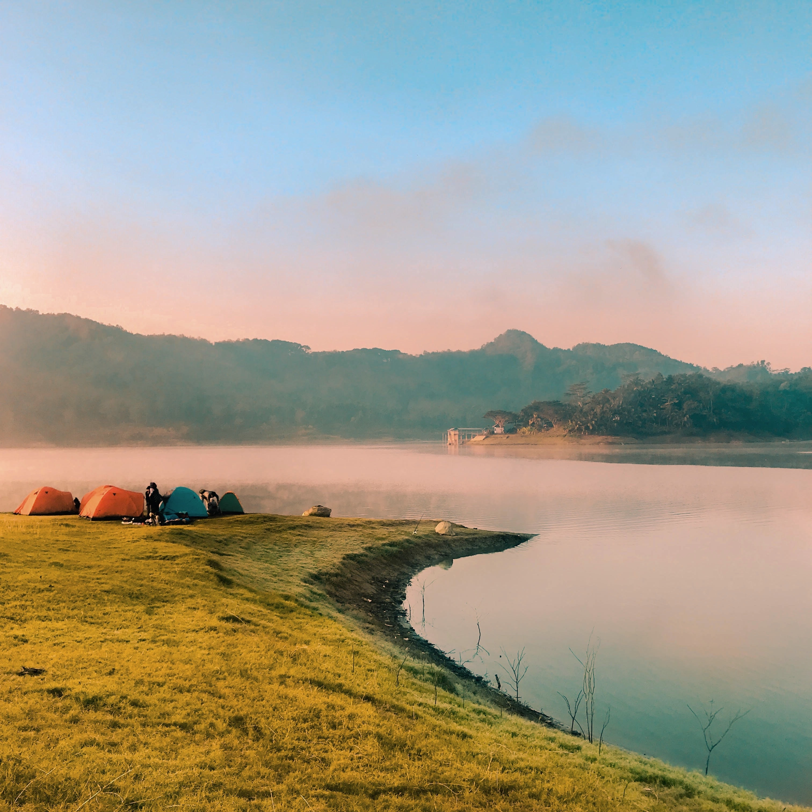
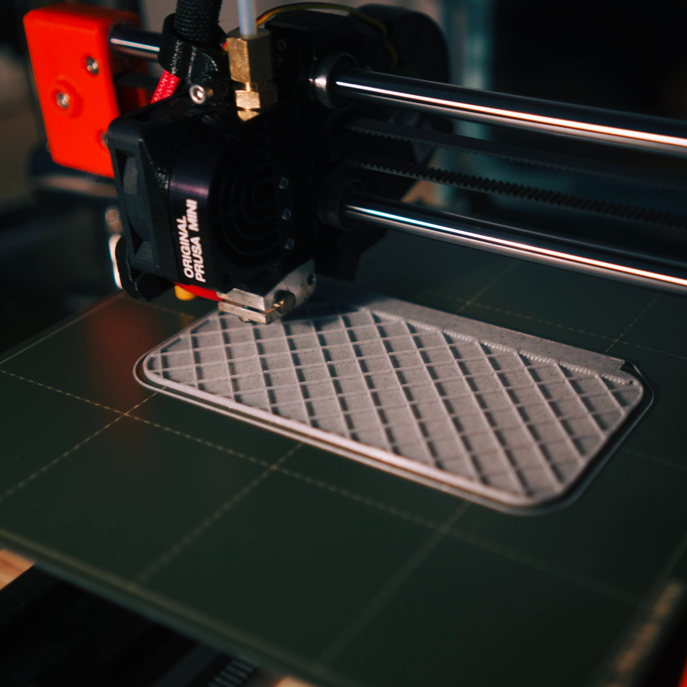

## Nick Vazquez

Hi there! I'm Nick Vazquez - a student studying [Software Engineering](https://se.iastate.edu/) at [Iowa State University](https://iastate.edu).

I'm a motivated individual who's fueled by passion for ideas and projects made to fix issues. I'm devoted to the future of our environment and helping those who are less fortunate than myself. I'm a member of Iowa State University's [PrISUm Solar Car Team](https://prisum.org), where I serve as the current Strategy Director. (_Learn more about that [here](prisum.md)!_)

### My Passions

Software Development                 | The Great Outdoors      | 3D Printing                 | Light Fabrication                 |
:-----------------------------------:|:-----------------------:|:---------------------------:|:---------------------------------:|
 |  |  |  |

### Use the links below to navigate around my page:
* [About](about.md)
* [Projects](projects.md)
* [Around the interwebs](socials.md)
